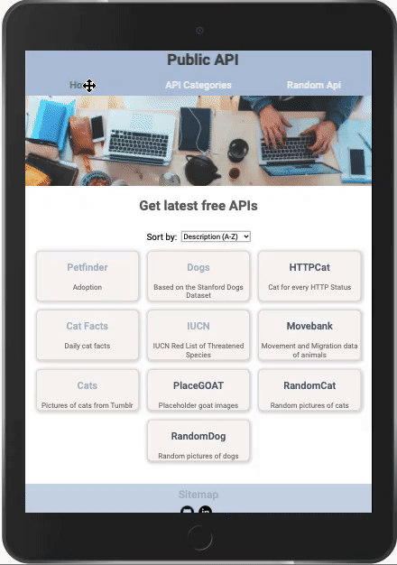

# Public API 
Test project using [Public APIs](https://github.com/davemachado/public-api) with Vue.js.

[▶️ Launch Demo](https://yaninatrekhleb.github.io/test-project/)

## The page contains:
* Navigation Menu with heading (Public API);
* 3 links;
* Footer;

**Links**.
1. **Home**. Home page shows 10 Apis on different themes. 
It is possible to sort by title and description (from A-Z).
Each API has its own container with a title and description. 
By clicking on the title, you can go to the page with details. 
The detail page has a title, description, and link to the original page with the API.
Below the link offers 3 pages on the same topic.

2. The link with **API Categories**. On this page you can find all API categories. By clicking on the name of a category, you navigate to a page with all available APIs on this topic.

3. **Random API**. Going to the Random API page you will receive a random API from random categories. By clicking on the "Choose another API" button, the API will change to another random API.

In website footer there is a link to the **Sitemap**. 
**Sitemap** contains information about the page and links.